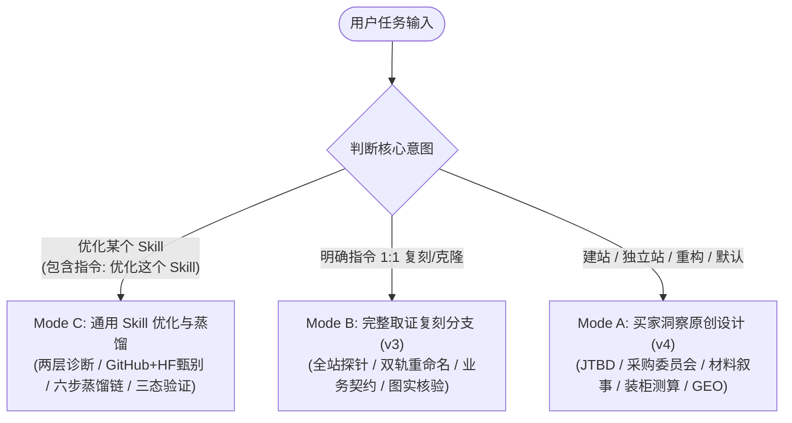

# RenWork Web Create Skill v4.1 🌐

[](https://github.com/cnproduct/renwork-web-create-skill)
[](LICENSE)
[](#)
[](#)
[](#)
[](#)
[](#)

> **Driven by Overseas Buyer Insights: Original Design, Strict Clone & Universal Skill Distillation**  
> 企业级出海独立站与通用技能蒸馏总控技能 v4.1：以海外买家洞察驱动原创增长，兼备 1:1 严格复刻与通用技能蒸馏进化。

---

## 📖 Introduction (项目升级定位)

现有网站复刻与建站工具往往陷入两个极端：要么简单像素级“抄作业”，把竞品的错误甚至专有侵权词原样照搬；要么全凭 AI 天马行空臆造“好看但不符合工业采购常识”的假大空页面。

**RenWork Web Create Skill v4.1** 完成了革命性质变，构建起三轨一体化总控体系：
1. **Mode A（默认：买家洞察原创增长）**：买家与行业深研 → 关键页和成功机制蒸馏 → 独特视觉创造 → 采购决策支持 → SEO/GEO 验证；
2. **Mode B（复刻：1:1 严格证据复刻）**：当明确要求完整复刻时，全站探针取证、CSS 令牌提取、文化双轨重命名去风险化、100% 绝对业务契约保障；
3. **Mode C（通用：Skill 优化与蒸馏）**：内置通用优化模式，支持优化自身及任意领域 Skill，执行两层诊断、GitHub/Hugging Face 资源甄别、六步机制蒸馏链与三态验证交付。

---

## 🏛️ 三轨工作流总控矩阵 (Triple-Track Workflow)



1. **买家任务与采购委员会研究 (JTBD)**：
   - 研究最小单元固定为 **“细分品类 × 买家角色 × 目标市场 × 语言 × 采购阶段”**；
   - 为使用者、技术评估者、商业决策者、财务风控角色 4 大角色分别配备专属证据库；
   - 严格执行企业事实、公开观察、待验证假设的三层数据隔离。
2. **行业与贸易格局洞察 (Trade & Seasonality)**：
   - 建立“行业变化 → 采购影响 → 企业可兑现能力 → 买家行动”分析链；
   - 引用 WTO Tariff、EU Access2Markets 权威贸易关税数据；
   - 结合海运周期倒推大买家采购决策黄金窗口期。
3. **从复刻升级为机制蒸馏 (Mechanism Distillation)**：
   - 挑选可信度标杆、采购信息组织标杆、视觉天花板标杆 3 个互补标杆；
   - 运用对照学习、反事实检查、跨行业类比、失败蒸馏 4 种学习方法；
   - 借鉴 Pattern2Code 评测思路，打破 AI 过度整齐化的弊端，保留有意义的版式例外。
4. **行业叙事与原创视觉导演 (Creative Direction)**：
   - 视觉语言从材料物理特性、加工工艺与应用环境中自然生长；
   - 提出权威工程技术流、极简当代设计风、工业体量制造风 3 套鲜明差异化提案；
   - 精选解释行动效，严格支持移动端与 `prefers-reduced-motion` 替代体验。
5. **用采购知识组织 SEO 与 GEO**：
   - 将买家任务映射到真实页面：发现机会、比较方案、验证规格、评估风险、准备采购；
   - 创造可引用的原创参数与透明算法，使 AI 搜索引擎（Perplexity、ChatGPT Search）作为权威信源引述。
6. **用结果反馈修正 Skill (Closed Loop)**：
   - 真实交付后记录有效表达与误解点，回写为规则条目持续进化。

---

## 💼 专业资源融合矩阵 (Integrated Provenance)

| 资源 | 提炼的核心精华 | 在本 Skill 中的实战用途 |
|---|---|---|
| **Jobs to Be Done (JTBD)** | 功能/情绪/社会任务，采购触发条件与期待收益 | 从“买家是谁”深入到“为什么现在采购、怎样判断成功” |
| **Product Marketing** | 定位、采购委员会 4 大角色、异议、替换动力与证明需求 | 分清使用者、技术员、决策者与财务，分别组织内容 |
| **外贸市场研究 Skill** | 产品×目标国家研究、本地语言检索、事实与推断三层隔离 | 结合官方贸易关税形成目标市场机会与进入路径 |
| **Frontend Design & Taste** | 从行业受众推导设计语言，控制构图、字体与动效呼吸感 | 建立有行业辨识度的视觉方向，拒绝俗套通用模板 |
| **samber/cc-skills** | 研究交叉验证、设计策略先行、设计系统严密审视 | 减少泛化模板和未经核实的推断 |
| **Free Tools** | 用产品相关的小工具解决真实买家决策问题 | 按需装配 20GP/40HQ 装柜测算器、材料耐温选型表 |
| **Pattern2Code & Design2Code** | 布局还原评测、识别模型过度整齐化（过度对齐）偏差 | 评测原创页面，保护重点大图与特色排版节奏 |
| **b2b-limestone-geo-site-builder** | 全球标杆排查三大巨头模型、文化双轨重命名、图实一致质检 | 驱动标杆解构、去风险重构与全链路询盘闭环 |
| **b2b-global-brand-site-master** | 21 行业外贸决策链、默认站点安全防护、海运装柜测算器 | 驱动行业选型、默认边缘安全网关与整柜配载计算 |
| **Anthropic Skill Creator** | Skill 结构规范、工作流两层差距分析、自动化评估测试 | 驱动通用技能优化模式，诊断能力缺口与清除冗余提示词 |
| **Hugging Face Skills** | 数据集/模型沙箱边界与评测基准规范 | 规范外部资源甄别，明确界定 Skill 与 Dataset/Model 的技术边界 |

---

## 🧬 通用 Skill 优化与蒸馏能力 (Mode C)

支持按需加载优化任意领域的 Skill（包括优化自身）：

```bash
# 典型调用指令
用 renwork-web-create-skill 优化这个 Skill：〈本地路径或仓库地址〉。结合实际任务和失败案例，从本机、GitHub、Hugging Face 寻找专业能力，蒸馏融合后验证效果。
```

### 1. 通用演进原则
**理解任务 → 诊断缺口 → 寻找专业方法 → 学习有效机制 → 适配创造 → 对照验证 → 沉淀经验**

### 2. 两层精准诊断模型
- **通用维度**：需求理解、工作流程、证据质量、工具使用、输出标准、验证机制、维护成本与提示词信噪比；
- **领域维度**：仅根据目标任务动态注入（如数据清洗、复杂算法、排版渲染），**严禁向非出海建站 Skill 强加外贸、关税或 SEO/GEO 规则**。

### 3. 六步机制蒸馏链
拒绝简单复制大段提示词，所有采纳的机制按六步链记录演进：
`来源观察 → 有效机制 → 适用条件 → 目标 Skill 适配 → 产物具体变化 → 验证证据`

### 4. 经验三态分类 (Three Confidence States)
- **[已验证 Verified]**：有自动化测试脚本或真实执行日志通过；
- **[推导规则 Inferred Rules]**：合乎逻辑推导得出，明确标明适用范围与假设前提；
- **[待试验 Hypothetical]**：新设想或未经充分实操检验，标注待测试，绝不伪装为成熟经验。

---

## 🎯 四大典型验收测试场景 (Definition of Done)

### 场景 A：石材工程采购 (Architectural Stone / Limestone)
- **采购角色**：建筑师、景观工程师、商业总包采购；
- **核心任务**：ASTM C568 抗折抗压、AS 4586 防滑等级、大面积色差控制、20GP 重货限重防爆柜；
- **视觉风格**：大地燕麦沙色调、DM Serif Display 典雅大标题、微距凹凸肌理与顶豪落地实景 100% 对齐。

### 场景 B：餐厨与食品容器 (Food Containers / Bento Boxes)
- **采购角色**：商超品类买手、亚马逊大卖品牌商、餐饮供应链总监；
- **核心任务**：FDA 21 CFR / LFGB 德国食品接触检测、-20°C~120°C 微波冷冻安全、二次注塑防漏胶圈；
- **视觉风格**：纯净白底高对比、深森林绿安全点缀、圆润倒角、高密度参数抽屉。

### 场景 C：工业电子与自动化配件 (Industrial Electronics / Hardware)
- **采购角色**：硬件研发工程师、系统集成商、采购风控主管；
- **核心任务**：RoHS/REACH 环保认证、电压公差、接口标准、元器件替代料方案；
- **视觉风格**：深钛灰与精密蓝底色、等宽工业字体 (Mono)、线框剖面图、无多余装饰动效。

### 场景 D：通用 Skill 优化与跨领域蒸馏 (Universal Skill Optimization)
- **核心任务**：执行两层缺口诊断，剔除夸大自述与无效提示词，生成 `templates/SKILL_OPTIMIZATION.md` 报告并通过自动化测试；
- **合格标准**：无强制无关规则、代码防御性提升、三态经验分类准确归档。

---

## 📦 Directory Structure (目录结构)

```text
renwork-web-create-skill/
├── SKILL.md                          # 核心技能指令与三轨工作流路由 (v4.1.0)
├── README.md                         # 技能使用手册与架构解析
├── LICENSE                           # MIT 开源协议
├── assets/
│   └── industries.json               # 21 行业外贸参数与便当盒/餐厨容器标准配置
├── scripts/
│   ├── site_forensics.py             # 目标站点深度探针与 DOM/CSS/SKU 提取
│   ├── extract_design_tokens.py      # CSS 令牌解析与 DESIGN.md 自动生成
│   ├── geo_seo_engine.py             # 5合1 Schema、Sitemap、robots.txt、llms.txt 编译器
│   ├── layout_typography_auditor.py  # 排版对齐、容器溢出与图片无障碍全域审计
│   ├── test_tools.py                 # 自动化工具链综合测试脚本
│   └── dev_server.py                 # 轻量本地静态预览与 RFQ API 收集服务
├── references/
│   ├── buyer-and-trade-research.md   # 买家任务、采购委员会与官方贸易格局研究指南
│   ├── mechanism-distillation-and-creative-direction.md # 机制蒸馏与原创视觉导演指南
│   ├── skill-optimization.md         # 通用 Skill 优化、两层诊断与机制蒸馏深度指南
│   ├── benchmark-discovery-methodology.md # 全球标杆排查与三大巨头模型深度方法论
│   ├── site-protection.md            # 默认站点防护、防抓取与反镜像嵌套规范
│   ├── procurement-components.md     # 行业采购组件、装柜测算器与 RFQ 协议
│   ├── turnstile.md                  # Cloudflare Turnstile 隐形人机验证规范
│   ├── rfq-backend.md                # Cloudflare Worker 询盘处理与落盘后端
│   ├── b2b-design-tokens.md          # 国际高转化 B2B 视觉语言规范
│   ├── geo-citability-guide.md       # Princeton KDD 2024 GEO 白皮书
│   ├── b2b-seo-schema-spec.md        # 5合1 结构化数据 Schema 黄金标准
│   ├── pixel-clone-contract.md       # 像素级复刻与绝对业务契约指南
│   ├── traffic-and-originality.md    # 采购任务流量映射与原创性对照指南
│   └── skill-fusion.md               # 外部资源与上游依赖融合台账
├── templates/
│   ├── BUYER_STRATEGY.md             # 项目级买家战略与增长简报标准模板
│   ├── SKILL_OPTIMIZATION.md         # 通用 Skill 优化与机制蒸馏报告模板
│   ├── edge-worker.mjs               # Cloudflare / Edge 安全防护与 API 路由
│   ├── assets/js/sourcing_estimator.js # 20GP / 40HQ 国际海运集装箱装柜测算模块
│   └── b2b-factory-starter/          # 开箱即用的工业出海官网高保真套件
└── tests/
    └── test_skill_assets.py          # 资产与脚本完整性自动化测试套件
```

---

## 📄 License
MIT © 2026 [cnproduct](https://github.com/cnproduct) · RenWork AI Innovation Team
