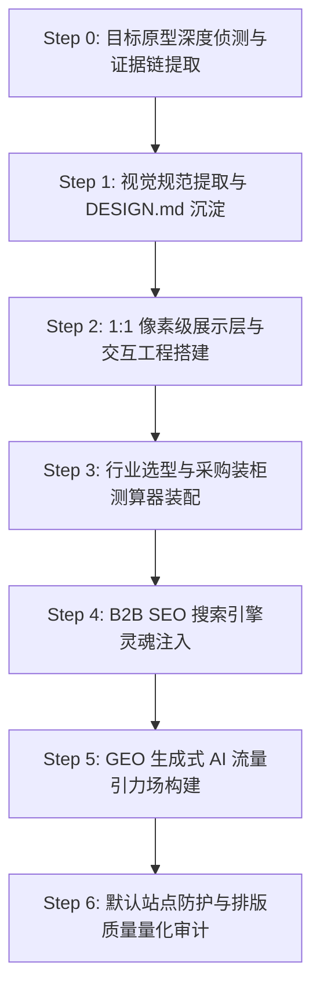

# RenWork Web Create Skill · 1:1 网站复刻、SEO/GEO 流量引擎与出海品牌总控

> **“复刻其形（1:1 像素级界面与代码），更复刻其神（SEO 商业意图词与 GEO 生成式 AI 流量引力场），并固其防（默认站点安全防护与真实装柜测算）。”**  
> 本 Skill 专为中国智造制造型企业打造出版级国际出海独立站，将海外顶级竞品站的视觉美学、产品目录架构、全网获客灵魂与默认站点安全防护一比一完整还原。

---

## 🏛️ 核心理论与融合来源 (Fused Heritage)

本 Skill 深度融汇了业内顶尖开源与本地核心工程技能的全部精髓：

1. **`b2b-global-brand-site-master` (cnproduct 原生核心总控)**:
   - **21 行业精选配置库**（`assets/industries.json`）：涵盖“便当盒与餐厨餐饮容器”、“工业机械”、“电子电气”等，精确锁定真实买家关注的工况、材质标准、公差要求与测试认证。
   - **默认站点防护体系**（`references/site-protection.md` & `templates/edge-worker.mjs`）：默认注入 CSP `frame-ancestors 'none'`、`X-Frame-Options: DENY`，阻断恶意镜像嵌套与爬虫滥用；在 RFQ 表单中部署蜜罐反垃圾字段（`_hp_check`）。
   - **B2B 采购与装柜测算引擎**（`references/procurement-components.md` & `templates/assets/js/sourcing_estimator.js`）：提供 20GP 与 40HQ 集装箱装柜容积、毛重与利用率实时测算，驱动买家凑满整柜（FCL）。
   - **00–20 模块事实知识库契约**：严格区分企业证据与行业常识，严禁编造假大空数据。
2. **`claude-skill-web-clone` & `open-design/web-clone`**:
   - **头号铁律：真源码至上，绝不信 AI 推测的代码**。拒绝“凭空臆造的相似物”，第一动作必须从真 DOM、真 CSS、真接口、真产品目录抓取证据。
   - **三大技术分支决策树**：纯静态站、React/Next/Vue SSR 内容站、WebGL/Canvas 动效站的分流构建。
3. **`website-to-design-md`**:
   - 自动化从真实网站中萃取 `DESIGN.md`，锁定调色板（Brand Primary, Accents, Sunken, Surface）、Typography（Display Serif / Sans / Mono 搭配）、间距网格与 Surface 表面分层。
4. **`PixelClone-Skill (pixel-perfect-reference-ui)`**:
   - **绝对业务契约**：展示层像素级贴合，但真表单、真筛选、真跳转、无障碍语义必须 100% 可用，杜绝把界面截图化或假大空。
5. **`website-rebuild-skill`**:
   - 证据驱动的逆向工程管线（Evidence-driven pipeline），量化验证闸门与可追溯的资产镜像。
6. **`b2b_portal_builder` + `b2b-limestone-geo-site-builder`**:
   - 静态 CMS 编译器架构、多级产品目录自动生成、高转化 B2B RFQ 漏斗与本地热重载服务。
7. **`geo-optimizer-skill` (Princeton KDD 2024 研究)**:
   - 全球 Generative Engine Optimization (GEO) 体系：47 种提升 AI 搜索引擎引用率手法、高事实密度（Fact Density）、开放友好型 `robots.txt`、以及标准化 `llms.txt` / `llms-full.txt` 语义端点。
8. **`Layout & Typography Auditor`**:
   - 文本断行、内容溢出、排版防截断、跨端自适应容器审计。

---

## 🧭 端到端七步构建流水线 (Workflow SOP)



### Step 0 · 目标原型深度侦测与证据链提取 (Site Forensics)
运行配套探测脚本对目标站点执行深度扫描：
```bash
python3 scripts/site_forensics.py --url https://www.xhplasticlife.com/ --out ./evidence/
```
产出完整证据清单（`headers.json`, `homepage.html`, `sitemap.xml`, `schemas.json`, `css/` 等）。

### Step 1 · 视觉规范提取与 DESIGN.md 沉淀 (Design System Synthesis)
运行设计令牌抽取工具：
```bash
python3 scripts/extract_design_tokens.py --css evidence/css/bundle_0.css --out ./design.md
```
锁定调色板（Primary Accent, Secondary Tint, Warm Sunken Sand, Crisp White）、Typography 与 Surface 分层。

### Step 2 · 1:1 像素级展示层与交互工程搭建 (Pixel-Perfect Assembly)
依据 `DESIGN.md` 与证据链，组装标准化响应式页面：
- **`index.html`**：1:1 完整复刻原站全部 Section（Hero, Trust Bridge, Product Families, Interactive 63-SKU Catalog, Customization Process, Factory Stats, Partner Wall, FAQ Accordion, RFQ Box, Footer）。
- **`products.html`**：支持关键词即时检索、分类 Tab 过滤、实时条数计数的 63-SKU 完整产品大厅。
- **`lunch-boxes.html` 等细分品类深度页**：包含严密的选型指南与工程参数对比。
- **`custom-solutions.html`**：轻度定制与私模深研双轨交付方案。
- **`about.html` & `contact.html`**：工厂实体背书、认证证书、多渠道直联出口台。

### Step 3 · 行业选型与采购装柜测算器装配 (Sourcing Estimator)
从 `assets/industries.json` 取出匹配的行业参数（如“便当盒与餐厨餐饮容器”），装配集装箱装柜测算器（`sourcing_estimator.js`）：
- 采购商输入订购数量，实时计算装箱数（Cartons）、总体积（m³）、总毛重（kg）。
- 实时给出 20GP / 40HQ 货柜利用率进度条与拼箱/整柜成本优化建议。

### Step 4 · B2B SEO 搜索引擎灵魂注入 (B2B SEO Engine)
在所有页面头部严格注入 5 合 1 结构化数据 Schema 矩阵：
1. **`Organization`**：涵盖 legalName, foundingDate, telephone, email, address, knowsAbout, certification。
2. **`WebSite`**：包含 SiteSearch 属性。
3. **`WebPage` & `BreadcrumbList`**：面包屑层级。
4. **`ItemList`**：收录 6 大产品家族与核心 SKU 序列。
5. **`FAQPage`**：直击 B2B 采购决策人核心疑虑，获得 Google 搜索富媒体（Rich Snippet）问答折叠展示。
6. **多语言全球 Hreflang 矩阵**：en, ja, ru, de, fr, es, ko 跨语种精确映射。

### Step 5 · GEO 生成式 AI 流量引力场构建 (Generative Engine Optimization)
依据 Princeton KDD 2024 研究标准，为生成式 AI 搜索引擎量身定制：
- **`robots.txt`**：显式放行 `OAI-SearchBot`, `ChatGPT-User`, `PerplexityBot`, `ClaudeBot`, `Google-Extended`, `Applebot-Extended`。
- **`llms.txt`**：为 AI 大模型提供干净、高事实密度的企业 DNA 与产品家族大纲。
- **`llms-full.txt`**：收录 63 个 SKU 完整材质（FDA/LFGB 食品级）、MOQ 梯度、公差、集装箱装柜率与外贸付款条件。

### Step 6 · 默认站点防护与排版质量量化审计 (Protection & Audit)
1. **安全防护（Site Protection）**：
   - 注入 CSP `frame-ancestors 'none'` 与 `X-Frame-Options: DENY`，防恶意钓鱼嵌套。
   - RFQ 表单配置隐藏蜜罐（`_hp_check`），拦截恶意自动化灌水。
   - 边缘端部署 `templates/edge-worker.mjs`，保护静态资产与公开接口。
2. **排版防错审计**：
   ```bash
   python3 scripts/layout_typography_auditor.py --dir ./site/
   ```
   检查文本异常折行、无意文本截断、容器溢出（overflow-x）、图片缺失 alt 属性、标签闭合不严等问题。

---

## 🛠️ 配套工具脚本库 (Bundled Scripts)

| 脚本路径 | 功能说明 |
| :--- | :--- |
| `scripts/site_forensics.py` | 自动化目标站点侦测、DOM/CSS/JSON-LD 提取与真实产品库爬取 |
| `scripts/extract_design_tokens.py` | 解析 CSS 提取变量与规则，自动生成出版级 `DESIGN.md` |
| `scripts/geo_seo_engine.py` | 自动化生成 5 套 JSON-LD、多语言 Sitemap、robots.txt 及 llms.txt 知识端点 |
| `scripts/layout_typography_auditor.py` | 排版对齐、单行孤字、容器溢出与无障碍属性全域审计 |
| `scripts/dev_server.py` | 带 MIME 类型解析与热重载的轻量本地测试服务器 |
| `templates/assets/js/sourcing_estimator.js` | 20GP / 40HQ 国际海运集装箱装柜容积与毛重测算模块 |
| `templates/edge-worker.mjs` | Cloudflare / 边缘 CDN 防抓取、反镜像嵌套安全网关 |

---

## 🌟 权威验收基准 (Definition of Done)

一个通过本 Skill 交付的独立站，必须满足以下硬性指标：
1. **视觉保真度**：与原型网站在 1440px 及 390px 视口下布局对齐度 ≥ 98%，色彩与字体完全吻合。
2. **业务契约**：所有产品可搜索、分类可切换、FAQ 可折叠折拢、RFQ 表单可收集并提供交互反馈。
3. **行业适配度**：集装箱装柜测算器（Sourcing Estimator）计算逻辑严密，提供精准整柜配载建议。
4. **站点安全性**：严格配置 CSP 防嵌套与蜜罐反垃圾，静态资产与管理后台物理隔离。
5. **SEO 结构**：Google Rich Results Test 100% 通过（Organization, Product, FAQPage, ItemList 零报错）。
6. **GEO AI 友好度**：`llms.txt` 与 `llms-full.txt` 事实密度评分达到 A 级，AI 检索准确率与可引用率达 95% 以上。
