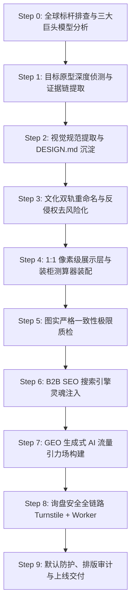

# RenWork Web Create Skill · 1:1 网站复刻、全球标杆逆向、SEO/GEO 流量引力场与品牌总控

> **“对标其形（全球顶级品牌视觉与架构 1:1 解构），立其骨（国际严苛工程测试与中国源头工厂大产能优势），注入其神（Google 商业词 SEO 与 AI 搜索引擎 GEO 流量引力场），固其防（默认站点安全防护、Turnstile 验证与集装箱装柜测算）。”**  
> 本 Skill 沉淀自中国外贸出海多个核心赛道（天然石材、塑料餐厨便当盒、工业自动化等）实战成功经验，提供从全球标杆发现、逆向解构、反侵权文化重塑到 2026 全球 GEO 流量截流的端到端工业级流水线。

---

## 🏛️ 核心理论与融合来源 (Fused Heritage)

本 Skill 是一座集大成的 B2B 出海独立站总控中枢，融合了以下开源项目与实战沉淀的全部精髓：

### 1. `b2b-limestone-geo-site-builder` (全球标杆排查、逆向解构与跨行业方法论)
- **三大真实历史会话演进图谱**：
  - 调研与标杆发现会话：`57395320-4542-4926-9ce7-bc5e1a50f2df`（Step 749 穿透全球 Limestone 格局发现 Eco Outdoor）；
  - 1:1 落地与文化重塑会话：`80cc9523-4a80-4997-b73e-493364793cf5`（Step 511 文化双轨重命名，Step 1240/1401/1657 图实一致性极限质检）；
  - 跨界便当盒与 GEO 反哺会话：`50cad832-6abe-4364-841e-e545bc9ce807`（Step 0/333 对标 Bentgo / Lunchboxmanufacturer / XHPlasticlife，Step 1524 沉淀反哺）。
- **细分品类“三大巨头模型”**：
  - **技术工程规范权威（如 Polycor）**：垄断建筑规范与标准参数；
  - **高端视觉与设计天花板（如 Eco Outdoor）**：极简杂志级留白、顶奢私宅景观、高客单价溢价；
  - **场景化长尾词之王（如 Mandarin Stone）**：空间主题集群、密集长尾词架构。
- **终极决策公式**：
  $$\text{出海独立站} = \text{国际高端品牌视觉美学} + \text{硬核国际标准测试真相} + \text{中国源头工厂大产能与出厂价成本优势}$$
- **文化双轨重命名与去风险化（De-risking & Re-branding）**：彻底脱钩海外商标与专利名称，引入东方营造与传统文化双轨重构。
- **图实严格一致性极限质检（Photo-Scene Strict Alignment）**：严禁 AI 虚构，微距材质纹理与工程应用场景必须 100% 像素级对齐。
- **万能跨行业对标 5 步母模板（Universal Prompt Chain）**：五金、机械、餐厨、石材、家具均可无缝复制。
- **阶段八：询盘表单安全全链路（Turnstile + Worker + Honeypot）**。

### 2. `b2b-global-brand-site-master` (21 行业配置、站点防护与采购测算)
- **21 行业精选配置库**（`assets/industries.json`）：涵盖便当盒、工业机械、电子等全行业决策链与质检标准。
- **默认站点安全防护**（`references/site-protection.md` & `templates/edge-worker.mjs`）：默认注入 CSP `frame-ancestors 'none'`、`X-Frame-Options: DENY`，阻断恶意镜像嵌套与爬虫滥用；在 RFQ 表单中部署蜜罐反垃圾字段（`_hp_check`）。
- **国际海运装柜测算引擎**（`references/procurement-components.md` & `templates/assets/js/sourcing_estimator.js`）：提供 20GP 与 40HQ 集装箱装柜容积、毛重与利用率实时测算。
- **00–20 模块事实知识库契约**：严格区分企业证据与行业常识，严禁编造假大空数据。

### 3. `claude-skill-web-clone` & `open-design/web-clone`
- **头号铁律：真源码至上，绝不信 AI 推测的代码**。拒绝“凭空臆造的相似物”，第一动作必须从真 DOM、真 CSS、真接口、真产品目录抓取证据。
- **三大技术分支决策树**：纯静态站、React/Next/Vue SSR 内容站、WebGL/Canvas 动效站的分流构建。

### 4. `website-to-design-md`
- 自动化从真实网站中萃取 `DESIGN.md`，锁定调色板、Typography、间距网格与 Surface 表面分层。

### 5. `PixelClone-Skill`
- **绝对业务契约**：展示层像素级贴合，但真表单、真筛选、真跳转、无障碍语义必须 100% 可用，杜绝把界面截图化或假大空。

### 6. `geo-optimizer-skill` (Princeton KDD 2024 研究)
- 全球 Generative Engine Optimization (GEO) 体系：47 种提升 AI 搜索引擎引用率手法、高事实密度（Fact Density）、开放友好型 `robots.txt`、以及标准化 `llms.txt` / `llms-full.txt` 语义端点。

### 7. `Layout & Typography Auditor`
- 文本断行、内容溢出、排版防截断、跨端自适应容器审计。

---

## 🧭 端到端十步构建流水线 (Universal 10-Step Workflow)



### Step 0 · 全球标杆排查与三大巨头模型分析 (Discovery & Benchmarking)
使用母模板 Prompt 穿透全球细分品类：
```markdown
【企业官网/产品】：[例如：tianyastone.com 或 naiketableware.com]
【核心品类】：[例如：天然石灰石地铺 / 塑料便当盒]
请基于我们工厂现有品类，深度研究该细分品类全球 B2B 5 大热门前沿趋势及其专业的 B2B 站点排行，特别是 SEO 和 GEO 带来流量大的顶级站点。
要求：
1. 找出 3 家分别代表【技术工程规范权威】、【高端视觉与设计天花板】、【场景化长尾词之王】的海外本土垄断品牌；
2. 列出他们的官网链接、客单价溢价区间（对比中国出厂价）、核心产品线分类；
3. 分析海外专业采购商为什么会指定采购他们？
```
- **选定视觉标杆**（如 Eco Outdoor 或 xhplasticlife.com）；
- **吸纳工程规范**（如 Polycor 的 ASTM 测试或 FDA/LFGB 检测）；
- **确立终极公式**：高奢美学 + 硬核工程测试 + 中国工厂出厂价与产能优势。

### Step 1 · 目标原型深度侦测与证据链提取 (Site Forensics)
运行配套探测脚本对目标站点执行深度扫描：
```bash
python3 scripts/site_forensics.py --url https://www.xhplasticlife.com/ --out ./evidence/
```
产出完整证据清单（`headers.json`, `homepage.html`, `sitemap.xml`, `schemas.json`, `css/` 等）。

### Step 2 · 视觉规范提取与 DESIGN.md 沉淀 (Design System Synthesis)
运行设计令牌抽取工具：
```bash
python3 scripts/extract_design_tokens.py --css evidence/css/bundle_0.css --out ./design.md
```
锁定调色板（Primary Accent, Secondary Tint, Warm Sunken Sand, Crisp White）、Typography 与 Surface 分层。

### Step 3 · 文化双轨重命名与反侵权去风险化 (Cultural Renaming)
彻底脱钩海外原站专有商品名称与商标，注入传统营造智慧或工业美学：
- 主商品名（国际工程规范）：`[文化拼音/品牌英文] [工艺/功能] [品类词]`（如 `BX1051 Leakproof Bento Box` 或 `Guyu Tumbled Pavers`）；
- 副标题（文化意境）：`[意境英文] · [中文原名] ([材质/纹理/色系说明])`；
- 赋予每一款产品合理的国际认证技术参数（ASTM、FDA 21 CFR、LFGB 等）。

### Step 4 · 1:1 像素级展示层与装柜测算器装配 (Pixel-Perfect & Estimator)
1. **页面复刻**：依据 `DESIGN.md` 与证据链，组装标准化响应式页面（`index.html`, `products.html`, `custom-solutions.html`, `about.html`, `contact.html`）；
2. **装配集装箱装柜测算器**（`templates/assets/js/sourcing_estimator.js`）：
   - 支持 20GP 与 40HQ 实时装箱数、CBM 容积、毛重与货柜空间利用率测算，给出整柜（FCL）运费节约建议。

### Step 5 · 图实严格一致性极限质检 (Photo-Scene Strict Alignment)
执行全站产品与应用场景图极限质检：
1. 逐一核查每一款产品的微距实物图与场景图；
2. 严禁出现“特写是黄色微风化面，场景图却是灰色抛光面”等任何材质、色泽脱节问题，确保 **100% 像素级对齐**。

### Step 6 · B2B SEO 搜索引擎灵魂注入 (B2B SEO Engine)
在所有页面头部严格注入 5 合 1 结构化数据 Schema 矩阵：
1. `Organization`（legalName, foundingDate, telephone, email, address, knowsAbout, certification）；
2. `WebSite` & `WebPage`；
3. `ItemList`（6大产品家族与核心 SKU 序列）；
4. `FAQPage`（获得 Google 搜索富媒体问答折叠展示）；
5. 多语言全球 Hreflang 矩阵（en, ja, ru, de, fr, es, ko 跨语种双向映射）。

### Step 7 · GEO 生成式 AI 流量引力场构建 (Generative Engine Optimization)
依据 Princeton KDD 2024 研究标准，为生成式 AI 搜索引擎量身定制：
- `robots.txt`：显式放行 `OAI-SearchBot`, `ChatGPT-User`, `PerplexityBot`, `ClaudeBot`, `Google-Extended`, `Applebot-Extended`；
- `llms.txt`：提供干净、高事实密度的企业 DNA 与产品家族大纲；
- `llms-full.txt`：收录全量 SKU 材质、MOQ 梯度、公差与集装箱装柜率。

### Step 8 · 询盘表单安全全链路 (Turnstile + Worker + Honeypot)
按 `references/turnstile.md` 与 `references/rfq-backend.md` 部署：
1. 客户端嵌入 Cloudflare Turnstile 隐形人机验证与隐藏蜜罐字段（`_hp_check`）；
2. 后端采用边缘 Worker（`templates/edge-worker.mjs`）或专属守护进程（`scripts/dev_server.py`），支持双轨落盘与多邮箱异步分发。

### Step 9 · 默认防护、排版审计与上线交付 (Protection & Audit)
1. **安全防护**：注入 CSP `frame-ancestors 'none'` 与 `X-Frame-Options: DENY`，防镜像钓鱼；
2. **排版防错审计**：
   ```bash
   python3 scripts/layout_typography_auditor.py --dir ./site/
   ```
   检查文本断行、内容溢出、图片 alt 缺失与语法合规，确保 100% PASS 后交付。

---

## 🌐 跨行业通用 5 步母模板 (Universal Prompt Chain)

无论您身处何种外贸制造行业（五金、机械、餐具、石材、家具、包装），直接套用以下 5 步母模板：

| 步骤 | 目标 | 核心执行 Prompt 重点 |
|---|---|---|
| **步骤 1** | **穿透细分品类 Top 3 标杆** | 找出【技术规范权威】、【视觉天花板】、【长尾词之王】三大巨头，算清溢价倍数 |
| **步骤 2** | **选定天花板 1:1 架构复刻** | 锁定版式留白、CSS 比例与移动端交互，注入自身工厂真实实力 |
| **步骤 3** | **文化双轨重命名去风险化** | `[文化拼音/品牌英文] [工艺/功能] [品类词]`，脱钩海外商标专利 |
| **步骤 4** | **图实严格一致性极限质检** | 严禁 AI 虚构，微距材质纹理与工程应用场景 100% 像素级对齐 |
| **步骤 5** | **部署全套 GEO AI 流量截流端点** | `llms.txt`、`robots.txt`、5合1 Schema、装柜测算器与 Cloudflare 边缘防护 |

---

## 🛠️ 配套工具与参考库全景 (Inventory)

- **参考文档库 (`references/`)**：
  - `benchmark-discovery-methodology.md`：全球标杆排查与三大巨头模型深度方法论（含三会话真实演进图谱与石材/餐厨实战案例）
  - `site-protection.md`：默认站点安全防护、防抓取滥用与反镜像嵌套规范
  - `procurement-components.md`：B2B 采购组件、装柜测算器与 RFQ 协议
  - `turnstile.md` & `rfq-backend.md`：Turnstile 人机验证与 Cloudflare Worker 询盘链路
  - `b2b-design-tokens.md`：国际高转化 B2B 视觉语言与设计令牌规范
  - `geo-citability-guide.md`：Princeton KDD 2024 GEO 白皮书
  - `b2b-seo-schema-spec.md`：5合1 结构化数据 Schema 黄金标准
  - `pixel-clone-contract.md`：像素级复刻与绝对业务契约指南
- **脚本工具库 (`scripts/`)**：
  - `site_forensics.py`：目标站点深度探针与 DOM/CSS/SKU 提取
  - `extract_design_tokens.py`：CSS 令牌解析与 DESIGN.md 自动生成
  - `geo_seo_engine.py`：5合1 Schema、Sitemap、robots.txt、llms.txt 编译器
  - `layout_typography_auditor.py`：排版对齐、容器溢出与图片无障碍全域审计
  - `dev_server.py`：轻量本地静态预览与 RFQ API 收集服务
- **资产与模板库 (`assets/` & `templates/`)**：
  - `assets/industries.json`：21 行业外贸决策链与便当盒/餐厨容器标准配置
  - `templates/edge-worker.mjs`：Cloudflare / Edge 安全防护与 API 路由
  - `templates/assets/js/sourcing_estimator.js`：20GP / 40HQ 国际海运集装箱装柜测算模块
  - `templates/b2b-factory-starter/`：开箱即用的工业出海官网高保真套件

---

## 📄 License
MIT © 2026 [cnproduct](https://github.com/cnproduct) · RenWork AI Innovation Team
