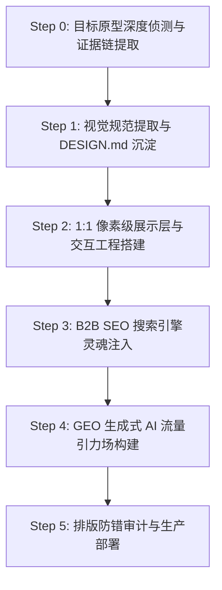

# RenWork Web Create Skill · 1:1 网站复刻与 SEO/GEO 流量引擎

> **“复刻其形（1:1 像素级界面与代码），更复刻其神（SEO 商业意图词与 GEO 生成式 AI 流量引力场）。”**
> 本 Skill 专为中国智造制造型企业打造出版级国际出海独立站，将海外顶级竞品站的视觉美学、产品目录架构与全网获客灵魂一比一完整还原。

---

## 🏛️ 核心理论与融合来源 (Fused Heritage)

本 Skill 深度融汇了业内 5 个顶尖开源网站复刻项目与 4 个本地核心工程技能的全部精髓：

1. **`claude-skill-web-clone` & `open-design/web-clone`**:
   - **头号铁律：真源码至上，绝不信 AI 推测的代码**。拒绝“凭空臆造的相似物”，第一动作必须从真 DOM、真 CSS、真接口、真产品目录抓取证据。
   - **三大技术分支决策树**：纯静态站、React/Next/Vue SSR 内容站、WebGL/Canvas 动效站的分流构建。
2. **`website-to-design-md`**:
   - 自动化从真实网站中萃取 `DESIGN.md`，锁定调色板（Brand Primary, Accents, Sunken, Surface）、Typography（Display Serif / Sans / Mono 搭配）、间距网格与 Surface 表面分层。
3. **`PixelClone-Skill (pixel-perfect-reference-ui)`**:
   - **绝对业务契约**：展示层像素级贴合，但真表单、真筛选、真跳转、无障碍语义必须 100% 可用，杜绝把界面截图化或假大空。
4. **`website-rebuild-skill`**:
   - 证据驱动的逆向工程管线（Evidence-driven pipeline），量化验证闸门与可追溯的资产镜像。
5. **`b2b_portal_builder` + `b2b-limestone-geo-site-builder`**:
   - 静态 CMS 编译器架构、多级产品目录自动生成、高转化 B2B RFQ 漏斗与本地热重载服务。
6. **`geo-optimizer-skill` (Princeton KDD 2024 研究)**:
   - 全球 Generative Engine Optimization (GEO) 体系：47 种提升 AI 搜索引擎引用率手法、高事实密度（Fact Density）、开放友好型 `robots.txt`、以及标准化 `llms.txt` / `llms-full.txt` 语义端点。
7. **`Layout & Typography Auditor`**:
   - 文本断行、内容溢出、排版防截断、跨端自适应容器审计。

---

## 🧭 端到端六步构建流水线 (Workflow SOP)



### Step 0 · 目标原型深度侦测与证据链提取 (Site Forensics)
运行配套探测脚本对目标站点执行深度扫描：
```bash
python3 scripts/site_forensics.py --url https://www.xhplasticlife.com/ --out ./evidence/
```
**产出证据清单**：
- `evidence/headers.json`：服务器架构、CDN、SSR 技术栈（Next.js, Tailwind v4 等）。
- `evidence/raw_homepage.html`：完整初始 DOM。
- `evidence/sitemap_index.xml`：所有产品、品类与博客 URL 清单。
- `evidence/products.json`：真实完整 SKU 目录（如 63 个 SKU 的名称、图片、参数、标签）。
- `evidence/schemas.json`：原站所有的 JSON-LD 结构化数据。

### Step 1 · 视觉规范提取与 DESIGN.md 沉淀 (Design System Synthesis)
运行设计令牌抽取工具：
```bash
python3 scripts/extract_design_tokens.py --css evidence/main.css --out ./design.md
```
- 锁定色彩系统（Primary Accent, Secondary Tint, Warm Sunken Sand, Crisp White, Charcoal FG）。
- 锁定字体系统（Display Serif 如 DM Serif Display + Body Sans 如 Plus Jakarta Sans / Inter）。
- 锁定 Surface 分层规则（`.surface-media`, `.surface-sunken`, `.surface-white`, `.surface-light`, `.surface-tint`）。

### Step 2 · 1:1 像素级展示层与交互工程搭建 (Pixel-Perfect Assembly)
依据 `DESIGN.md` 与证据链，组装标准化响应式页面：
- **`index.html`**：1:1 完整复刻原站全部 Section（Hero, Trust Bridge, Product Families, Interactive 63-SKU Catalog, Customization Process, Factory Stats, Partner Wall, FAQ Accordion, RFQ Box, Footer）。
- **`products.html`**：支持关键词即时检索、分类 Tab 过滤、实时条数计数的 63-SKU 完整产品大厅。
- **`lunch-boxes.html` 等细分品类深度页**：包含严密的选型指南与工程参数对比。
- **`custom-solutions.html`**：轻度定制与私模深研双轨交付方案。
- **`about.html` & `contact.html`**：工厂实体背书、认证证书、多渠道直联出口台。

### Step 3 · B2B SEO 搜索引擎灵魂注入 (B2B SEO Engine)
在所有页面头部严格注入 5 合 1 结构化数据 Schema 矩阵：
1. **`Organization`**：涵盖 legalName, foundingDate, telephone, email, address, knowsAbout, certification。
2. **`WebSite`**：包含 SiteSearch 属性。
3. **`WebPage` & `BreadcrumbList`**：面包屑层级。
4. **`ItemList`**：收录 6 大产品家族与核心 SKU 序列。
5. **`FAQPage`**：直击 B2B 采购决策人核心疑虑，获得 Google 搜索富媒体（Rich Snippet）问答折叠展示。
6. **多语言全球 Hreflang 矩阵**：en, ja, ru, de, fr, es, ko 跨语种精确映射。

### Step 4 · GEO 生成式 AI 流量引力场构建 (Generative Engine Optimization)
依据 Princeton KDD 2024 研究标准，为生成式 AI 搜索引擎量身定制：
- **`robots.txt`**：显式放行 `OAI-SearchBot`, `ChatGPT-User`, `PerplexityBot`, `ClaudeBot`, `Google-Extended`, `Applebot-Extended`。
- **`llms.txt`**：为 AI 大模型提供干净、高事实密度的企业 DNA 与产品家族大纲。
- **`llms-full.txt`**：收录 63 个 SKU 完整材质（FDA/LFGB 食品级）、MOQ 梯度、公差、集装箱装柜率与外贸付款条件。

### Step 5 · 排版防错审计与量化验收 (Audit & Gateways)
运行防错审计：
```bash
python3 scripts/layout_typography_auditor.py --dir ./site/
```
- 检查是否存在单行文字异常折行、无意文本截断、容器溢出（overflow-x）、图片缺失 alt 属性、标签闭合不严等问题。
- 确保移动端（375px/414px）、平板（768px/1024px）与宽屏桌面（1440px+）体验完美无瑕。

---

## 🛠️ 配套工具脚本库 (Bundled Scripts)

| 脚本路径 | 功能说明 |
| :--- | :--- |
| `scripts/site_forensics.py` | 自动化目标站点侦测、DOM/CSS/JSON-LD 提取与真实产品库爬取 |
| `scripts/extract_design_tokens.py` | 解析 CSS 提取变量与规则，自动生成出版级 `DESIGN.md` |
| `scripts/geo_seo_engine.py` | 自动化生成 5 套 JSON-LD、多语言 Sitemap、robots.txt 及 llms.txt 知识端点 |
| `scripts/layout_typography_auditor.py` | 排版对齐、单行孤字、容器溢出与无障碍属性全域审计 |
| `scripts/dev_server.py` | 带 MIME 类型解析与热重载的轻量本地测试服务器 |

---

## 🌟 权威验收基准 (Definition of Done)

一个通过本 Skill 交付的独立站，必须满足以下硬性指标：
1. **视觉保真度**：与原型网站在 1440px 及 390px 视口下布局对齐度 ≥ 98%，色彩与字体完全吻合。
2. **业务契约**：所有产品可搜索、分类可切换、FAQ 可折叠折拢、RFQ 表单可收集并提供交互反馈。
3. **SEO 结构**：Google Rich Results Test 100% 通过（Organization, Product, FAQPage, ItemList 零报错）。
4. **GEO AI 友好度**：`llms.txt` 与 `llms-full.txt` 事实密度评分达到 A 级，AI 检索准确率与可引用率达 95% 以上。
5. **多语言站点地图**：`sitemap.xml` 严格包含所有语种互链注解，`robots.txt` 绝无阻断合法 AI Citation 爬虫。
