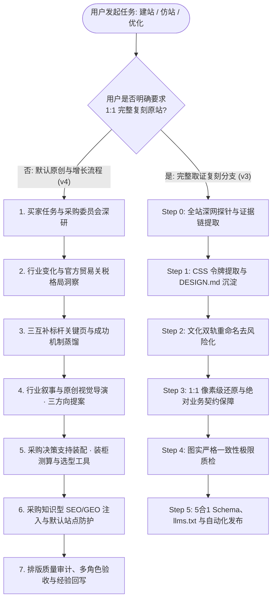

# RenWork Web Create Skill v4：以海外买家洞察驱动原创设计与增长

> **“以买家任务为靶心，以材料工艺为灵魂，以工程真相为底牌，以 AI 引用为引力场，以默认防护为壁垒。”**  
> 核心使命：网站既能让海外大买家感受到中国制造企业独特的审美质感与品牌辨识度，更能帮助他们识别市场机会、规避供应风险、顺畅完成工程选型与大宗采购。

---

## 🏛️ v4 核心架构：默认流程与双轨路由 (Dual-Track Workflow)

- **默认模式（v4 原创增长）**：深研后创造、按行业识别多种采购角色、关键页与机制蒸馏、行业叙事与精选动效；
- **复刻分支（v3 证据复刻）**：当用户明确指令为“1:1 复刻某站”、“抄这个站”、“像素级克隆”时，无缝切入 v3 全站取证、文化重命名与像素级还原管线。

---

## 🚀 六项核心能力升级 (The Six Core Capabilities)

### ① 买家任务与采购委员会研究 (JTBD & Buying Committee)
- **研究最小单元**：固定为 **“细分品类 × 买家角色 × 目标市场 × 语言 × 采购阶段”**。
- **三维买家任务拆解**：
  - *功能任务*：满足工程抗折/耐温/密封指标、通过目标国准入测试、控制到岸单件成本；
  - *情绪任务*：消除大货延误开天窗、批量质检召回、被高层问责的采购焦虑；
  - *社会任务*：在采购委员会前展现专业度、符合终端品牌 ESG 环保回收指标。
- **采购委员会 4 大角色专属弹药**：
  - *使用者 (End User)*：微距人体工学、可拆卸清洁维护图解、真实施工/餐厨实景；
  - *技术评估者 (Technical Evaluator)*：SGS/TUV 原版检测报告、材质证明书 (CoA)、公差明细；
  - *商业决策者 (Decision Maker)*：私模独家保护承诺、3天极速样品、45台自动化机台产能看板；
  - *财务与物流角色 (Economic Buyer)*：阶梯价格表、20GP/40HQ 装柜实时测算器、整柜运费优化。
- **三层数据隔离原则**：
  - *企业事实 (Firm Truth)*：经核准的厂房、设备、发票、认证；
  - *公开观察 (Public Observation)*：海关提单统计、官方关税政策、标杆公开发布数据；
  - *待验证假设 (Hypothesis)*：推导的市场机会与客群偏好，标注“待核验”并列出核验路径。

### ② 行业与贸易格局洞察 (Trade & Seasonality Insights)
- **分析链模型**：`行业变化 → 采购影响 → 企业可兑现能力 → 买家行动`。
- **官方权威贸易数据源**：
  - [WTO Tariff & Trade Data](https://www.wto.org/english/tratop_e/tariffs_e/tariff_data_e.htm)：核验 MFN 最惠国关税及特别贸易壁垒；
  - [EU Access2Markets](https://trade.ec.europa.eu/access-to-markets/en/my-trade-assistant)：核验欧盟 27 国 HS 编码、进口 VAT 与技术合规文件；
  - [USITC HTS & DataWeb]：核验美国 Section 301 关税与反倾销/反补贴 (AD/CVD) 动态。
- **采购季节倒推规划**：结合实际海运期（4-6周）、生产准备期（3-4周）与样品确认期（2-3周），精准锁定采购决策黄金窗口，在旺季来临前 60 天组织专题流量截流。

### ③ 从复刻升级为机制蒸馏 (Mechanism Distillation)
- **三互补标杆组合法**：
  - *标杆 A（行业可信度）*：学习其工程参数披露、合规认证架构与测试白皮书；
  - *标杆 B（采购信息组织）*：学习其空间应用分类、多维筛选器与选型矩阵；
  - *标杆 C（视觉天花板）*：学习其杂志级留白、微距摄影光影、字偶排版与质感节奏。
- **四种高阶学习方法**：
  1. *对照学习 (Comparative Learning)*：并列对比 Top 10% 标杆与后 30% 普通站，去除泛化自夸，锁定高转化实证；
  2. *反事实检查 (Counterfactual Check)*：假想移除某动效或组件，若不影响买家选型决策则坚决删除，拒绝装饰废品；
  3. *跨行业类比 (Cross-Industry Analogy)*：将工业级精密刀具检索矩阵迁移到石材或餐厨容器参数表；
  4. *失败蒸馏 (Failure Distillation)*：把被用户纠偏（如场景图与特写图不符）固化为不可违反的质检军规。
- **借鉴 Pattern2Code 评测思路**：打破大模型容易犯的“过度整齐化 (Over-regularization)”弊端，主动保护 Hero SKU 跨列破格排版与大图节奏。

### ④ 行业叙事与原创视觉导演 (Creative Direction)
- **视觉从材料与工艺中生长**：
  - *天然石材*：大地燕麦沙色基底、DM Serif Display 衬线标题、微风化呼吸感大间距；
  - *食品容器*：深森林绿（健康无毒）与纯白、圆角防护、高对比度清晰参数；
  - *工业机械*：深碳灰与精密工程蓝、等宽高对比数字、线框剖面图解。
- **三套差异化提案先行**：
  - 方向 1：权威工程技术流 (Engineering-First)；
  - 方向 2：极简当代设计风 (Architectural / Designer-Led)；
  - 方向 3：工业体量制造风 (Mass-Manufacturing Power)。
- **精选解释行动效**：动效只用于展示结构、密封装配或参数联动，严禁无意义晃动，并提供移动端与减少动态效果（`prefers-reduced-motion`）的完全替代方案。

### ⑤ 用采购知识组织 SEO 与 GEO (Knowledge-Driven SEO/GEO)
- **买家任务映射真实页面**：
  - 发现机会页（行业合规趋势指南、新材料选型）；
  - 比较方案页（PP vs Tritan vs 304 不锈钢多维对比表）；
  - 验证规格页（产品 63-SKU 抽屉大厅、CoA 证书原件）；
  - 评估风险页（工厂 ISO/BSCI 验厂视频、第三方测试报告）；
  - 准备采购页（20GP/40HQ 装柜测算器、阶梯报价与样品申请表）。
- **原创可引用价值优先**：输出经核验的物理参数、透明配载计算、真实施工工法，使 ChatGPT Search / Perplexity 在回答采购商时作为第一证据引述。
- **严格分离度量指标**：搜索曝光、AI 引擎引用提及、网站实际访问、真实有效询盘分别独立记录，不以虚幻的内部评分推定实际平台收录。

### ⑥ 用结果反馈修正 Skill (Closed-Loop Evolution)
- 每次交付后复盘：
  - 哪些内容帮助买家消除了异议？
  - 哪些排版或用词引起了海外客户误解？
  - 哪些行业参数推导缺少扎实证据？
- 形成的结论沉淀为：`[触发条件] → [验证方法] → [证据链条] → [适用边界]`，回写进 Skill 规则库。

---

## 🛠️ 项目核心交付文档约定

每个项目在独立目录中交付以下核心产物，直接驱动代码落地：

| 交付文件 | 核心作用 | 负责内容 |
| :--- | :--- | :--- |
| **`BUYER_STRATEGY.md`** | **买家战略与增长简报** | 买家 4 大角色任务与异议、官方关税数据、企业可兑现能力、三套视觉方向决策 |
| **`DESIGN.md`** | **视觉系统与设计规范** | 从材料推导出的颜色 Tokens、字体层级、间距系统、Surface 分层与动效规范 |
| **`TRAFFIC_MAP.md`** | **采购任务流量映射图** | 关键词搜索意图、买家任务、对应页面、内链网络、证明证据与转化 CTA 路径 |
| **`ORIGINALITY.md`** | **原创性与差异化对照表** | 对标借鉴的机制、原创重构的要素、反侵权双轨命名、图实一致性核验记录 |
| **生产级站点源码** | **实际可运行的网站** | `index.html`, `products.html`, `css/`, `js/`, `robots.txt`, `sitemap.xml`, `llms.txt` |

---

## 🌟 三大典型行业验收场景 (Definition of Done by Scenarios)

### 场景 A：石材工程采购 (Architectural Stone / Limestone)
- **核心角色**：建筑师、景观工程师、商业总包采购。
- **关键任务**：ASTM C568 抗折抗压、AS 4586 防滑等级、大面积色差控制、20GP 重货限重防爆柜。
- **视觉风格**：大地燕麦沙色调、DM Serif Display 典雅大标题、微距凹凸肌理与顶豪落地实景 100% 对齐。
- **必配工具**：天然石材物理指标快照、20GP 集装箱重货 21.5 吨限重测算器。

### 场景 B：餐厨与食品容器 (Food Containers / Bento Boxes)
- **核心角色**：商超品类买手、亚马逊大卖品牌商、餐饮供应链总监。
- **关键任务**：FDA 21 CFR / LFGB 德国食品接触检测、-20°C~120°C 微波冷冻安全、二次注塑防漏胶圈、小批量定制 Pantone 色。
- **视觉风格**：纯净白底高对比、深森林绿安全点缀、圆润倒角、高密度参数抽屉。
- **必配工具**：63-SKU 即时筛选大厅、20GP/40HQ 散货与整柜装柜满载率测算器。

### 场景 C：工业电子与自动化配件 (Industrial Electronics / Hardware)
- **核心角色**：硬件研发工程师、系统集成商、采购风控主管。
- **关键任务**：RoHS/REACH 环保认证、电压公差、接口标准、元器件替代料方案、长期供货生命周期保障。
- **视觉风格**：深钛灰与精密蓝底色、等宽工业字体 (Mono)、线框剖面图、无多余装饰动效。
- **必配工具**：元器件选型交叉参数表、批量阶梯报价与样品即时申领单。

---

## 🔒 默认站点安全防护全链路 (Built-in Security & Protection)

每个项目默认生成并装配以下防护体系：
1. **防止镜像嵌套 (Clickjacking Defense)**：全局配置 `Content-Security-Policy: frame-ancestors 'none'` 与 `X-Frame-Options: DENY`；
2. **反爬虫滥用与接口限流**：边缘端配置 `templates/edge-worker.mjs`；
3. **RFQ 表单防机器人垃圾灌水**：客户端部署隐藏蜜罐（`_hp_check`）与 Cloudflare Turnstile 隐形人机验证；
4. **双轨数据落盘**：结构化 JSON 与带 UTF-8 BOM 的 Excel 友好 CSV 归档。
