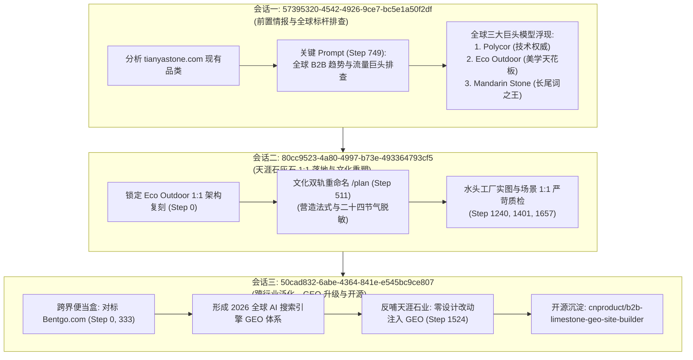

# 全球行业标杆发现与逆向解构方法论 (Benchmark Discovery & Reverse Engineering Methodology)

本文档完整沉淀了 **Fujian Tianya Cultural Stone Co., Ltd. (tianyalimestone.com)** 与 **Naike Custom Bento Factory (custombentofactory.com)** 在全球标杆定位与独立站构建过程中的核心方法论，记录了从最初情报探测、全球三大巨头确立、文化双轨重命名，到跨行业泛化的全流程真实提示词（Prompt）与实战经验。

---

## 🏛️ 一、 真实历史溯源：三大关键会话的演进脉络

本项目的方法论并非凭空产生，而是跨越了三个真实会话的实战推演与闭环：



---

## 🔍 二、 核心解密：Eco Outdoor 是如何被精准发现的？

很多中国外贸工厂建站时，习惯于在 Google 搜索同行或套用泛滥的 Shopify/Wordpress 模板，导致全站呈现“低价白牌代工厂”气质。我们在会话 `57395320-4542-4926-9ce7-bc5e1a50f2df` 的 **Step 749** 避开了这种思维陷阱，输入了决定性的**核心提示词**：

### 1. 发现 Eco Outdoor 的原始 Prompt（会话 57395320... Step 749）
```markdown
tianyastone.com 核心品类limestone全球 B2B 5 大热门前沿趋势及其专业的B2B站点排行，特别是SEO和GEO带来流量大的站点
```

### 2. 全球石材自然流量与大模型引用“三大巨头模型”
该提示词穿透了全球天然石灰石（Limestone）的流量格局，揭示了三种完全不同的成功路径：

| 标杆品牌 | 所属国别 / 定位 | 流量与商业特征 | 我们吸纳的核心价值 |
|---|---|---|---|
| **Polycor**<br>(`polycor.com`) | 🇺🇸 美国 / 🇨🇦 加拿大<br>矿业开采国家级巨头 | **建筑师技术规范与 GEO 引擎第一引用源**<br>垄断全美公建 CSI 规范 (`CSI Division 04 42 00`) 与 Revit BIM 模型，透明披露 ASTM C568 测试与 EPD 绿色碳足迹。 | **吸纳其工程硬核**：<br>引入 ASTM C97/C170/C880 测试数据、CAD/BIM 资源中心与极度严谨的物理指标。 |
| **Eco Outdoor**<br>(`eco-outdoor.com`) | 🇦🇺 澳大利亚 / 🇺🇸 美国<br>顶奢景观与建筑石材商 | **高端私宅设计美学与高客单价天花板**<br>垄断 `Freeform limestone walling`、`Tumbled limestone pavers` 等高意图词。每一款石材关联 5–10 个顶豪落地实景，零售价高达 $90–$220/㎡（中国出厂价仅 $22–$48/㎡）。 | **吸纳其视觉与版式**：<br>1:1 解构其极简杂志级留白、`PPEiko` 衬线斜体字、沉浸式卡片与 5 大表面分类。 |
| **Mandarin Stone**<br>(`mandarinstone.com`) | 🇬🇧 英国<br>零售与工程石材巨头 | **欧洲长尾词搜索与选型指南之王**<br>彻底垄断 `Dijon limestone` 等经典词，按室内外空间（Kitchen, Bathroom, Pool）与规格建立起极度密集的主题集群（Topic Clusters）。 | **吸纳其分类逻辑**：<br>建立表面工艺专区（Tumbled, Antique, Brushed）与空间推荐导向。 |

### 3. 终极决策公式
$$\text{天涯石业独立站} = \text{Eco Outdoor 的视觉美学} + \text{Polycor 的 ASTM 工程真相} + \text{水头自营工厂 50,000㎡ 产能与出厂价优势}$$

---

## 🏗️ 三、 从对标到落地的实战提示词闭环（会话 `80cc9523...`）

在锁定 Eco Outdoor 之后，如何防止“画虎不成反类犬”或陷入海外侵权诉讼？我们在建站过程中执行了以下关键提示词链条：

### 1. 启动 1:1 架构复刻（Step 0）
```markdown
https://www.eco-outdoor.com/en-au/stone-flooring/limestone 1:1复刻这个网站的这个limestone页面的所有页面来作为tianyalimestone.com的产品页面，但是品牌，公司内容都用tystoneveneer.com的内容，只是这个网站的产品聚焦在limestone,其他品类只是列出并简单介绍。
```
* **核心动作**：以标杆的信息架构（IA）为蓝本，把天涯石业原先散乱杂糅的 5 大品类做“减法”，全力聚焦在天然石灰石这一高毛利品类上。

### 2. 文化双轨重命名与反侵权去风险化（Step 511）
```markdown
/plan 这些产品图片和命名都参考原图进行优化，比如参考中国古建筑或者参考中国24节气等进行全新的命名，或者其他的命名体系，请基于命名适当变换颜色和花纹，请用codex-img来生成类似的照片及对应的应用场景。先给我计划，我确定了再生成
```
* **核心动作**：彻底脱钩海外商标与专利名称。引入**“东方营造智慧 + 二十四节气”**，确立了 `[文化主名] [表面工艺] Pavers & Tiles` 双轨体系：
  - 滚磨面：`Guyu` (谷雨), `Zaojing` (藻井), `Fengya` (风雅), `Shanshui` (山水)
  - 仿古面：`Hanbai` (汉白), `Lanting` (兰亭), `Guyun` (古韵), `Dougong` (斗栱)
  - 喷砂拉丝面：`Daiwa` (黛瓦), `Wangchuan` (辋川)

### 3. 工厂真实素材搬迁与图实一致极限质检（Step 1240, 1401, 1657）
```markdown
https://www.tianyastone.com/ www.tystoneveneer.com 产品款式图片请尽量从这个网站里面的图片搬过来，应用场景图片可以根据这里面的这些产品图片进行生成应用场景的图片, tystoneveneer.com 文件夹里面有这些产品的照片。

这个场景跟产品不匹配，请全站检查每个款式的产品，务必场景跟每个款式的产品都一一匹配。

这个还是不匹配，请务必每个款式的产品都点击进去核查，应用场景图要跟产品一一匹配。
```
* **核心动作**：严禁 AI 天马行空胡乱渲染。微距产品图的表面风化凹坑、边缘手凿崩边程度，必须与工程应用场景（泳池边石、庭院地铺）在色调、纹理、反光度上 **100% 像素级对齐**。

---

## 🚀 四、 跨行业泛化与 2026 全球 GEO 体系（会话 `50cad832...`）

在耐克便当盒独立站（`custombentofactory.com`）的开发中，我们验证了这套方法论跨越行业的普遍有效性：

### 1. 便当盒跨界对标指令（Step 0, 333）
```markdown
https://bentgo.com/ 1:1 复刻这个网站，特别是SEO和GEO的部分，同时网站的内容和产品都使用 www.naiketableware.com， 网站的更多品类和关键词参考网站 https://www.lunchboxmanufacturer.com/ 和网站 https://www.xhplasticlife.com/products/lunch-boxes?utm_source=chatgpt.com

基于以下进行重点优化网站，特别是深度学习对标的top 3网站的seo和geo架构和内容，形成custombentofactory.com自己的独一无二的全球不同AI bot的吸流量运营手法。
```

### 2. 反哺天涯石业并开源沉淀（Step 1524）
```markdown
再给予以上进行优化这个网站 tianyalimestone.com 的seo和geo内容，页面设计不要更改。 同时把优化好的新建一个这个网站从最构思到成功优化的全过程的skill, 部署到github.com/cnproduct新建一个仓库
```
* **核心成果**：在保持天涯已打磨完美的 CSS 与前端视觉 100% 不变的前提下，完成了 `/ai/*.json` 4 大端点、25KB `llms-full.txt`、重货装柜算力引擎的无缝注入，并推送到开源仓库 `cnproduct/b2b-limestone-geo-site-builder`。

---

## 💎 五、 石材行业各细分品类顶级标杆导航库

当为其他石材企业寻找对标时，直接参考以下经实战检验的全球赛道天花板：

| 细分品类 | 全球顶级对标 (Benchmark) | 官网 | 为什么选它？（对标核心价值） |
|---|---|---|---|
| **天然石灰石 / 户外景观地铺** | **Eco Outdoor** (澳洲/全球) | `eco-outdoor.com` | 极简杂志风、法式拼花与泳池收口系统天花板 |
| **大型商业公建 / 矿山原石规格** | **Polycor** (北美) | `polycor.com` | CSI 建筑规范、BIM 资产库与 ASTM 测试权威 |
| **高端室内大理石 / 连纹奢石** | **Antolini Italy** (意大利) | `antolini.com` | 顶奢石材艺术展厅、灯光摄影与奢华材质交互巅峰 |
| **超薄柔性石皮 / 弯曲木工石材** | **Slate-Lite** (德国) | `slate-lite.com` | 1.5–2mm 超薄天然石皮开创者，极致的施工节点图 |
| **人造石英石 / 橱柜卫浴台面** | **Caesarstone** (以色列/全球) | `caesarstone.com` | 色彩灵感、空间 3D 渲染器与质保体系典范 |
| **外墙干挂文化石 / 乱形叠石** | **Eldorado Stone** (北美) | `eldoradostone.com` | 北美建筑师首选文化石，色彩混合方案与施工技术库 |
| **超薄岩板 / 瓷质大板 (Sintered)** | **Neolith** (西班牙) | `neolith.com` | 建筑外立面与整体家居定制，绿色环保与耐火耐磨标杆 |

---

## 🌐 六、 万能跨行业对标 5 步母模板（Universal Prompt SOP）

无论你从事何种外贸制造行业（五金、机械、餐具、家具、服装、包装），直接套用以下 **5 步 Prompt 链条**：

### 步骤 1：穿透全球细分品类 Top 3 标杆
```markdown
【企业自身官网/产品】：[例如：tianyastone.com 或 naiketableware.com]
【核心品类】：[例如：天然石灰石地铺 / 塑料便当盒 / 工业数控切削工具]

请基于我们工厂现有品类，深度研究该细分品类全球 B2B 5 大热门前沿趋势及其专业的 B2B 站点排行，特别是 SEO 和 GEO 带来流量大的顶级站点。
要求：
1. 找出 3 家分别代表【技术工程规范权威】、【高端视觉与设计天花板】、【场景化长尾词之王】的海外本土垄断品牌；
2. 列出他们的官网链接、客单价溢价区间（对比中国出厂价）、核心产品线分类；
3. 分析海外专业采购商为什么会指定采购他们？
```

### 步骤 2：选定视觉天花板 1:1 架构复刻
```markdown
我们将以【对标官网链接】为 1:1 架构与设计标杆，建立我们的独立站【新域名】：
1. 1:1 复刻其版式布局、CSS 留白比例、移动端交互与核心分类维度；
2. 网站的主体、公司介绍、工厂实力、排锯/数控设备全面采用我方【自身工厂真实资料】；
3. 暂时聚焦在该核心品类，其他延伸品类只做列表简要介绍。
```

### 步骤 3：文化双轨重命名（彻底规避侵权）
```markdown
/plan 我们要彻底剔除原标杆站点的所有专有商品名称与 Trademark，杜绝侵权风险。
请基于【中国传统文化 / 营造法式 / 二十四节气 / 工业硬核美学】为我们全部主力 SKU 进行全新的命名：
- 主商品名（国际工程规范）：`[文化拼音/品牌英文] [工艺/功能] [品类词]`
- 副标题（文化意境）：`[意境英文] · [中文原名] ([材质/纹理/色系说明])`
- 赋予每一款产品合理的国际认证技术参数（如 ASTM 吸水率/抗压、AS 4586 防滑等级、FDA/CE 认证等）。先出详细规划，我确认后再执行。
```

### 步骤 4：真实产品图与应用场景 1:1 严格对齐质检
```markdown
产品特写图必须优先使用我们工厂官方提供的真实高清摄影【提供路径或网址】。
请对全站每一个产品执行“图实严格一致性核查”：
1. 逐一点击检查每一款产品；
2. 检查其对应的渲染应用场景图（如泳池、庭院、餐桌、户外露营）；
3. 严禁出现“产品特写是黄色微风化面，场景图却是灰色抛光面”等任何材质、色泽、纹理脱节问题，确保 100% 像素级对应。
```

### 步骤 5：构建面向全球 AI 引擎的 GEO 流量截流端点
```markdown
在保持前端视觉设计与排版 100% 不变的前提下，为独立站部署面向 ChatGPT Search、Perplexity、Claude 的全球 GEO 吸流量体系：
1. robots.txt：放行 10 大主流 AI 抓取爬虫；
2. 静态知识端点：/ai/summary.json（工厂地理坐标与矿山实力）、/ai/faq.json（25个专业工程问答）、/ai/products.json（全量物理参数）；
3. 对标差异化端点：/ai/vendor-comparison.json，客观对比我们与【对标品牌】的差异（同等顶级质感 + 便宜 60% 的源头出厂价 + 柔性定制）；
4. 深度 RAG 知识全书：/llms-full.txt（注入行业专属力学计算，如重货集装箱载重公式）。
最后，将从构思到落地的全生命周期代码与测试集打包成专属 Skill，并同步到 GitHub 独立仓库。
```
