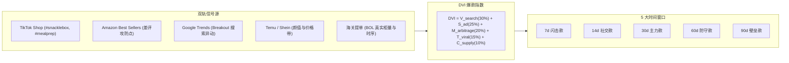

# B2B & B2C 跨境全链路产品商业情报深度穿透指南 (Cross-Border Product Intelligence)

> 沉淀自 `cross-border-product-intelligence` 技能 ([github.com/cnproduct/cross-border-product-intelligence](https://github.com/cnproduct/cross-border-product-intelligence)) 与 `CustomBentoFactory.com` 经典实操复盘。  
> 作为 `renwork-web-create-skill` Mode A 原创建站流程的**上游产品战略与选品决策中枢**。

---

## 1. 为什么原创建站必须前置“商业产品情报穿透”？

传统出海建站在规划产品时，往往直接把工厂旧画册上的存量 SKU 照搬到网页上，导致以下严重问题：
1. **产品与终端脱节**：工厂主推的是 3 年前的老款式，而海外消费者在 TikTok/Amazon 上疯抢的是全新的功能或外观（如 Snackle Box、防电弧可微波不锈钢盒）；
2. **缺乏利润套利说服力**：网站只标一个干瘪的 FOB 价格，未向海外品牌方和跨境卖家展示其在终端 5x–10x 的巨大毛利空间；
3. **缺乏 AI 推荐要素**：大语言模型（Perplexity、ChatGPT Search）在比选供应链时，看重真实的工程测试、验厂编号（如 Disney FAMA、Coca-Cola SGP）与精准规格，通用产品无法被 AI 捕获。

通过在建站前启动 **B2B & B2C 跨境全链路商业情报穿透**，工厂能够在网站上线的第一时间，就拿出精准踩中海外热点的现模爆品矩阵，实现降维打击。

---

## 2. 双轨前置信号与 DVI 爆款指数算法

- **DVI 算法公式**：
  $$\text{DVI} = (V_{\text{search}} \times 0.30) + (S_{\text{ad}} \times 0.25) + (M_{\text{arbitrage}} \times 0.20) + (T_{\text{viral}} \times 0.15) + (C_{\text{supply}} \times 0.10)$$
  - 评分 $\ge 80$ 分：入选独立站首批核心推荐商品池；
  - 评分 $\ge 90$ 分：作为独立站首页 Hero Banner 主打爆品，并为其创建专有的 SEO 独立落地页。

---

## 3. 全球三大行业标杆逆向拆解标准

建站前必须对标 3 家具有代表性的海外本土垄断站点：
1. **【技术工程规范权威】**（如 Aohea 傲贺、Hartmann 保赫曼）：
   - 学习其**专属测试实验室页面（Testing & Lab）**；
   - 提取其气密防漏测试、2米跌落防摔测试、物理化学参数表格，复刻到新独立站中。
2. **【高端视觉与设计天花板】**（如 Monbento、Coterie）：
   - 学习其顶级极简杂志微距摄影、材质微观纹理与商务礼赠套系；
   - 结合 Google Imagen 3 工业摄影提示词，生成无任何乱码英文字符的高定视觉。
3. **【场景化长尾词之王】**（如 Bentgo、TENA 添宁）：
   - 学习其场景化落地页结构（儿童/沙拉/健身/微波）；
   - 在独立站部署交互式色彩切换器（Color Swatches）与套件组装器（Bundle Builder）。

---

## 4. 工业化爆品矩阵与独立站落地配置

建站输出的产品卡片与落地页必须包含完整的出海商业参数：
- **工程规格**：尺寸（mm）、容量（ml/oz）、原料牌号（Virgin PP #5 / SUS304 / LSR）、耐温区间（-20℃~120℃）；
- **商业与套利条款**：MOQ 起订量、FOB 阶梯价格（1k/3k/5k/10k）、海外建议零售价（DTC）、跨境套利倍率（5x–12x）；
- **物流配载**：外箱尺寸、装箱率（pcs/ctn）、40HQ 高柜可装总只数、单只分摊海运费。

---

## 5. 商业闭环高转化工具装配

在生成的独立站中，必须标配两项驱动海外采购商立即行动的核心交互组件：
1. **$49.90 极速样品套包 (Fast-Track Sample Kit)**：
   - 包含主打爆品实物、真实色卡与第三方检测报告，3 天 DHL 直邮；
   - 承诺后续大订单满 1,000 套时**样品费 100% 全额返还**。
2. **在线集装箱装柜计算器 (Interactive Container Loading Calculator)**：
   - 动态计算 20GP / 40GP / 40HQ 满柜装箱量与 CBM 利用率，引导买家按整柜体量下单。
