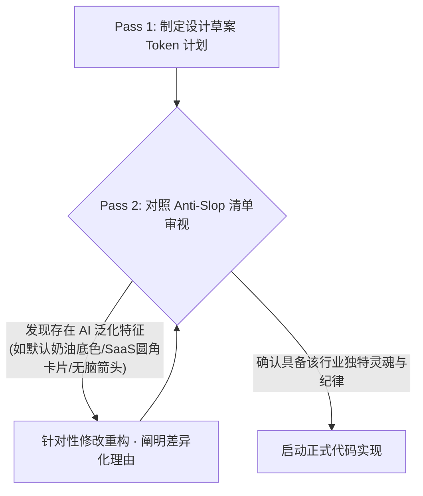

# Anthropic Frontend Design 反千篇一律与原创设计架构指南

> **核心来源**：深度融合自 Anthropic 官方核心技能 `anthropics/skills/skills/frontend-design`（17.5万+ Star 体系）。  
> **核心使命**：彻底根绝大语言模型生成网页时的“千篇一律与模版化套路（AI Slop）”，以设计工作室首席主创（Design Lead）视角，为每个客户/品类注入不可替代的独特视觉灵魂。  
> **互补协同**：本指南负责“**怎么设计**”（建立独特审美方向与高保真代码实现），与 Vercel 的 `web-design-guidelines`（负责“**有没有明显问题**”的上线前体检）构成 RenWork 前端生产的双引擎。

---

## 1. 任务启动前的四大强制上下文 (The 4 Mandatory Brief Constraints)

Anthropic 官方核心安装提醒明确强调：**在任务中严禁只写“做得高级一点”、“做个好看的网站”等空洞口号**。在敲下第一行代码前，必须强制明确以下 4 大约束：

```
┌─────────────────────────────────────────────────────────────────────────────┐
│                 任务输入四大强制约束 (Mandatory Constraints)                │
├─────────────────┬───────────────────────────────────────────────────────────┤
│ 1. 目标用户画像 │ 采购委员会 4 大角色（技术评估者/商业决策者/使用者/物流财务） │
│ 2. 设备与视口   │ 响应式端点（390px 移动竖屏、1024px 平板/笔记本、1440px 桌面）│
│ 3. 核心交互状态 │ 必须设计 Default、Hover、Active、Focus-visible、Disabled、 │
│                 │ Loading、Empty、Error 完整 8 态，拒绝静态僵尸卡片          │
│ 4. 品牌与材料限制│ 严禁凭空编造卡通元素，视觉必须由真实物理材料与工艺推导而来  │
└─────────────────┴───────────────────────────────────────────────────────────┘
```

---

## 2. 严厉根除：AI 页面最常见的 5 大模板化陈词滥调 (Anti-AI-Slop Blacklist)

大模型在未经约束时，会高度聚类于以下 5 种“一眼假”的 AI 默认套路。在 RenWork 建站流水线中，凡出现以下特征且无法给出充分材料理由的，一律判定为违规生成：

1. **“暖奶油色/暗黑科技”泛滥默认**：
   - 违规特征：无脑使用温润泛黄的暖奶油色（如 `#F4F1EA`）配纯黑，或者一律采用无脑的深黑底配紫粉渐变（`purple-to-pink gradient accents`）。
   - 正向要求：必须从行业真实材料中提取基底。石材用微风化燕麦砂（`#EFECE6`），食品容器用纯净灭菌白（`#FFFFFF`）与深森林安全绿（`#134E4A`），精密机械用冷轧钢灰（`#0F172A`）与铣削银。
2. **千篇一律的 SaaS 卡片积木套件 (The SaaS-Card Kit)**：
   - 违规特征：把所有内容切成一模一样的圆角矩形，全站使用统一的 `rounded-xl`，卡片底下全挂着千篇一律的浅灰软阴影（`rgba(0,0,0,0.08)`），卡片内部填充满毫无功能意义的渐变色块。
   - 正向要求：根据信息密度采用不同的 Surface 分层。对比型参数使用高密度紧凑边框表（Bordered Matrix）；主打款 Hero SKU 必须打破网格，采用跨列大画幅；严禁无意义的装饰性软阴影。
3. **僵化的模板化“金属构件” (Template Chrome)**：
   - 违规特征：
     - 每个标题上方无脑挂一个字母间距拉得很开的**全大写英文眉题**（Tracked-out ALL-CAPS eyebrow label，如 `// OVERVIEW //`）；
     - 元数据字符无脑用中圆点连接（`A · B · C`）；
     - 标签强制使用长破折号（`WORD — fragment`）；
     - 所有链接和按钮末尾机械地加上箭头（`Learn More →`）；
     - 所有数据指标无脑使用 Monospace 等宽字体。
   - 正向要求：只在真正需要表征序列或代码的地方使用等宽字体；链接按钮文本直接陈述确定动作（如 `Download ASTM C568 TDS (PDF)`），剔除多余的装饰箭头与无意义中圆点。
4. **单字着色与粗暴修辞 (One-Word Color Accent)**：
   - 违规特征：在主标题里刻意只把其中一个词染成彩色或斜体（如“Engineered for <span style="color:blue">Perfection</span>”），显得极度廉价。
   - 正向要求：让排版整体产生节奏感，使用字号级差、字重比对（如 700 衬线大标题 + 400 稳健无衬线正文）来传递层次，而不是给单个词涂颜色。
5. **浮夸无意义的滚动动效 (Scattershot Fade-and-Slide Animations)**：
   - 违规特征：页面上每个卡片、每行文字都挂着滚动淡入上升（`fade-and-slide-up`），用户每滚动一屏都在闪烁晃动，既卡顿又严重干扰专业买手快速查阅数据。
   - 正向要求：**动效只保留唯一的一处“核心震撼瞬间”（Hero Orchestrated Moment）**，或者仅用于回答用户的具体交互（如展开抽屉、切换颜色、切换装柜算法）。其余所有内容保持静止、清爽、随开即现。

---

## 3. 两轮设计规划法 (Two-Pass Design Planning)

在编码之前，必须严格执行“两轮设计规划”：



### Pass 1：提炼紧凑 Token 计划
1. **调色盘 (Palette)**：定义 4–6 个明确的 Hex 色值（主色、基底色、Surface 层级色、文字主色、文字次色、单个高亮对比色），给出具体的材料隐喻。
2. **字体家族与角色 (Typography)**：至多使用 1~2 组字体家族。如果是衬线体 + 无衬线体，必须性格分明（如 `DM Serif Display` 负责典雅建筑感，`Inter` 负责微观参数易读性）；
3. **布局概念与 ASCII 线框 (Layout & Wireframe)**：使用纯文本 ASCII 绘制核心页面的非对称节奏网格，明确对齐方式（左对齐为主，严禁大段正文居中）；
4. **独特性原则 (Unique Principles)**：写下 2~3 句本站点绝不妥协的视觉性格。

### Pass 2：自我批判与反同质化审查
- 审视 Pass 1 的方案：是否有任何部分是直接从其他项目随手套过来的“万能默认”？
- 如果发现该方案随便换个产品（比如把石材换成手机壳）依然“成立”，说明毫无行业独特性，必须推倒重来！
- 明确写出“我删除了什么默认套路，换成了什么契合本产品的独特设计”。

---

## 4. 大胆用在一处，克制留给全局 (Spend Boldness in One Place)

- **设计纪律**：一个优秀的界面如同高级建筑，只允许有一个绝对的视觉焦点（Hero Signature Moment）：
  - 可以是极致微距的材料光泽质感切换；
  - 可以是一个动态联动的 20GP 集装箱配载可视化切片；
  - 可以是一张极具视觉冲击力的跨列全宽工厂自动化机台实景。
- **香奈儿法则 (Chanel's Advice)**：出门前照照镜子，摘下一件配饰。
  - 在前端交付前，**主动审查并删掉至少一个多余的装饰性元素**（如多余的渐变边框、漂浮气泡、背景水波纹）；
  - 保持主视觉焦点周围绝对的纯粹、克制与呼吸感。

---

## 5. 功能性文案与主动语态法则 (Active-Voice Utility Copywriting)

文案是设计不可分割的组成部分，不是填充假字的占位符：

1. **以使用者视角命名 (User Perspective)**：
   - 错误：`Configuration System Module`（基于系统架构命名）
   - 正确：`Calculate Container Payload`（基于用户实际任务命名）
2. **主动语态与精准动作 (Active-Voice CTAs)**：
   - 错误：`Submit`, `Click Here`, `Learn More`
   - 正确：`Request Free 10x10cm Stone Sample`, `Download Full CE MDR Certificate (PDF)`
3. **状态语汇严格一致 (Vocabulary Cohesion)**：
   - 触发按钮是 `Request Sample` $\rightarrow$ 弹出窗标题必须是 `Requesting Sample` $\rightarrow$ 成功反馈 Toast 必须是 `Sample Request Sent`。严禁中途变更为 `Inquiry Dispatched` 等同义词。
4. **错误与空状态指明建设性行动 (Actionable Empty/Error States)**：
   - 错误提示不道歉、不含糊，直接给出补救操作（如“Invalid gross weight: max 21.5 tons for 20GP. Please reduce pallet count to continue.”）；
   - 空状态不摆烂，直接引导核心操作（如“No SKU selected yet. Click any limestone finish below to calculate container payload.”）。
